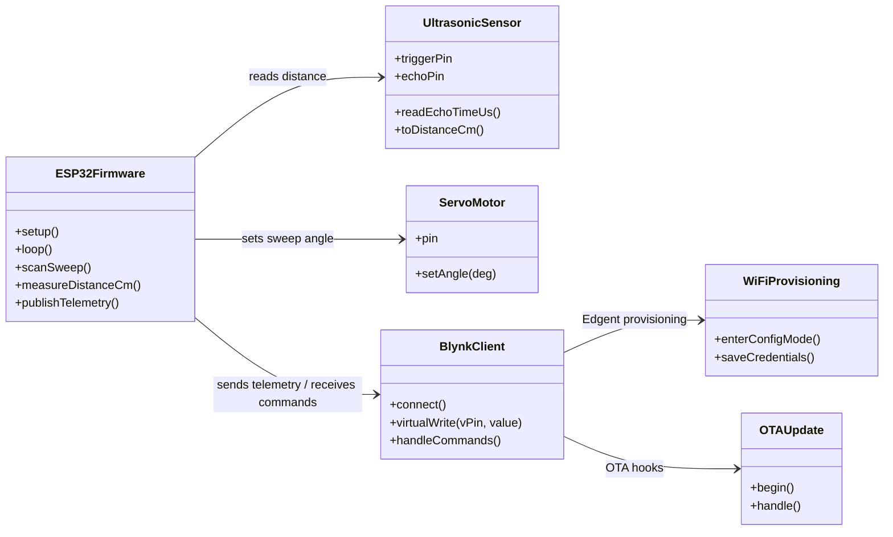
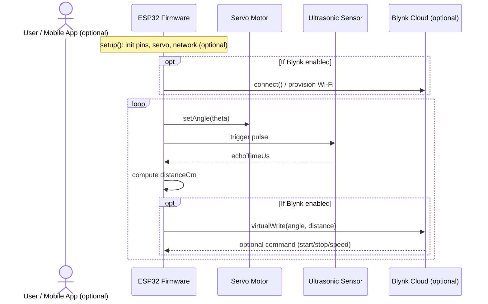

## 📡 Radar Model for Obstacle Detection and Ranging

This project implements a radar-like detection and ranging system using a microcontroller-based embedded platform. The system combines **PWM-controlled servo actuation** with an **ultrasonic distance sensor** to perform angular scanning and obstacle detection.

A servo motor, driven via Pulse Width Modulation (PWM), rotates the ultrasonic sensor across a predefined angular range. At each angular position, the ultrasonic sensor measures the distance to nearby objects using time-of-flight principles. The measured data is represented as pairs *(angle, distance)*, forming a two-dimensional scan of the environment.

The system also integrates a display module to provide real-time feedback of the measured distance and scanning angle. In advanced configurations, the detected object distance and angle can be transmitted wirelessly to a cloud-based IoT platform for remote monitoring, data logging, and further analysis.

This project demonstrates key embedded systems concepts, including PWM-based motor control, real-time sensor acquisition, embedded system integration, and optional IoT connectivity.

---

## 🟢 System Architecture
<!--## 🏗️ System Architecture -->

This project implements a low-cost radar-like detection and ranging system based on an **ESP32** microcontroller. The system combines a **servo-driven angular sweep** with **ultrasonic distance measurements** to generate a 2D representation of the surrounding environment. Optionally, measurements and system status can be transmitted wirelessly to an **IoT dashboard** for remote monitoring and control.

### 🏗️ Architectural Layers

**1. Control Layer (ESP32 Firmware)**  
The ESP32 firmware acts as the central controller of the system. It initializes all peripherals, manages the scanning logic, synchronizes sensor sampling with servo motion, and handles optional communication with external services.

**2. Perception Layer (Ultrasonic Sensor)**  
The ultrasonic sensor is responsible for distance estimation. At each scan angle, the ESP32 triggers the sensor and measures the echo return time. Distance is computed using time-of-flight principles.

**3. Actuation Layer (Servo Motor)**  
The servo motor provides angular motion for the scanning process. The firmware sets discrete angular positions within a defined sweep range, enabling directional distance measurements.

**4. Communication Layer (IoT / Blynk)**  
When enabled, the system connects to a Wi-Fi network and transmits scan data to a remote dashboard. This layer allows visualization, parameter tuning, and remote interaction.  
The architecture also supports **Over-The-Air (OTA) updates**, enabling wireless firmware upgrades without physical access to the device.

---

### 🔀 Data Flow
1. The ESP32 sets the servo motor to a target angle θ  
2. After a short stabilization delay, the ultrasonic sensor is triggered  
3. The echo return time is measured and converted into distance  
4. The pair *(angle, distance)* represents one scan sample  
5. Results are logged locally and optionally transmitted to the IoT dashboard  

---

### 📐Key Parameters
- **Sweep range**: angular limits of the scan (e.g., 0–180°)  
- **Angular resolution**: step size between successive angles  
- **Sampling delay**: time allowed for servo stabilization  
- **Maximum range & filtering**: rejection of invalid or noisy measurements  

---

### 🧾Design Notes
This system is a **scanning ultrasonic ranging prototype**, not a true RF radar. Measurement accuracy depends on sensor characteristics, object reflectivity, alignment, and environmental conditions. The modular architecture allows individual components (sensor, actuator, communication layer) to be tested and extended independently.

---

## 🟣 UML Diagram

## 🟠 Sequence Diagram

## 📁 Repository Structure

- `RADAR_Test0.ino` — integrated scanning and ranging prototype  
- `ultrasonic_sensor_test.ino` — standalone sensor validation  
- `servo_using_esp32.ino` — standalone servo control test  
- `test_blynk1.ino` — IoT connectivity and dashboard test

<!-- ## 📬 Contact

For questions regarding the implementation, usage, or citation of this work, please contact:

- **Email:** moussabolaoumarou@gmail.com -->
 

